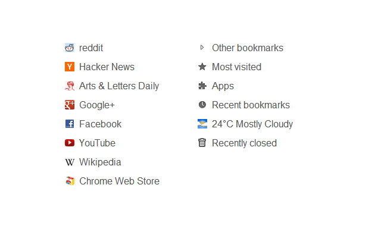
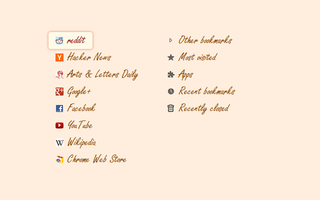
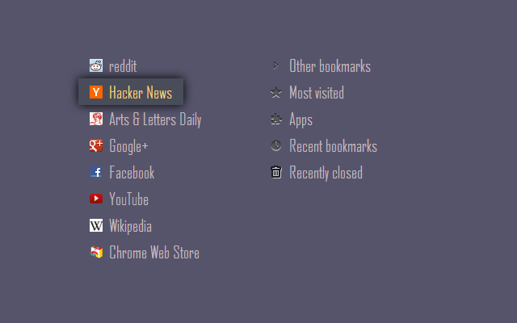
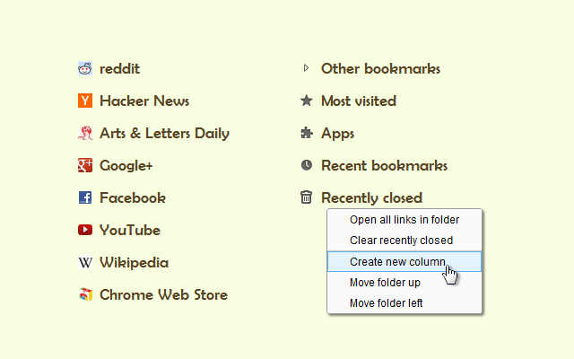
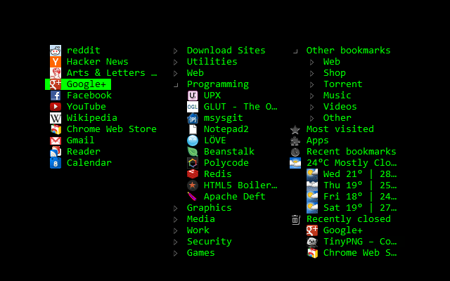

Humble New Tab Page
===================

Redesigned new tab page featuring your bookmarks, apps, most visited, recently closed, and weather in a custom layout.

### Features

- Simple, clean design
- Highly customizable
- Fast loading and lightweight

[Get it in the Chrome Web Store](https://chrome.google.com/webstore/detail/mfgdmpfihlmdekaclngibpjhdebndhdj)

This extension replaces the default new tab page. Drag and drop folders to create new columns or reorder them. The font, colors, spacing, and more can be customized from the options menu.

Screenshots
-----------

License
-------

This project is licensed under the **MIT License**, see [LICENSE_MIT.txt](LICENSE_MIT.txt) for details.

Changelog
---------

### Version 1.17 - January 24, 2016

- Fixed weather error

### Version 1.16 - August 29, 2014

- Added other devices folder
- Recently closed tabs preserve history
- Removed background process
- Chrome version 37 or later required

### Version 1.15 - July 6, 2014

- Fixed freezing issues

### Version 1.14 - May 11, 2014

- Reduced memory usage
- Added option to set number of items for recently closed, recent bookmarks, and most visited
- Added option for background image size
- Added link to bookmark manager in folder context menu

### Version 1.12 - August 18, 2013

- Reorder apps via drag and drop

### Version 1.11 - August 3, 2013

- Fixed launching packaged apps (Google Keep)
- Fixed launching file:/// and chrome:// URLs
- Fixed Mobile Bookmarks folder not being removable
- Disable weather if geolocation is denied
- Default layout changed to 2 columns
- Uninstall apps from the context menu
- Hide Google Wallet Service from apps

### Version 1.9 - December 30, 2012

- Uses geolocation for weather by default
- Fixed bug with drag and drop
- Added Chrome Web Store to apps

### Version 1.8 - November 9, 2012

- Redesigned options panel
- Added several new settings
- Performance tweaks
- Source code released under the MIT license

### Version 1.7 - September 8, 2012

- Added custom CSS field for advanced users
- Added option to hide Bookmarks bar and Other bookmarks

### Version 1.6 - August 30, 2012

- Added option to open links in new tabs
- Support local file for background image
- Weather errors fixed

### Version 1.5 - August 29, 2012

- Weather forecast now uses Yahoo
- System font list enabled on supported versions

### Version 1.4 - August 10, 2012

- Added option to disable the weather and other special folders
- Minor bug fixes

### Version 1.3 - August 9, 2012

- Fixed error on old Chrome versions

### Version 1.2 - August 8, 2012

- Added apps, most visited, recently closed, and weather
- More flexible layout with unlimited columns
- Open all links in folder from context menu
- Color themes and new default style
- Added smooth animation and highlight shadow
- Drag and drop to reorder folders and columns
- Background image support
- Bug fixes
- New name (formerly New Tab + Bookmark Tree)

### Version 1.1 - July 20, 2011

- Added options menu

### Version 1.0 - July 17, 2011

- Initial release
